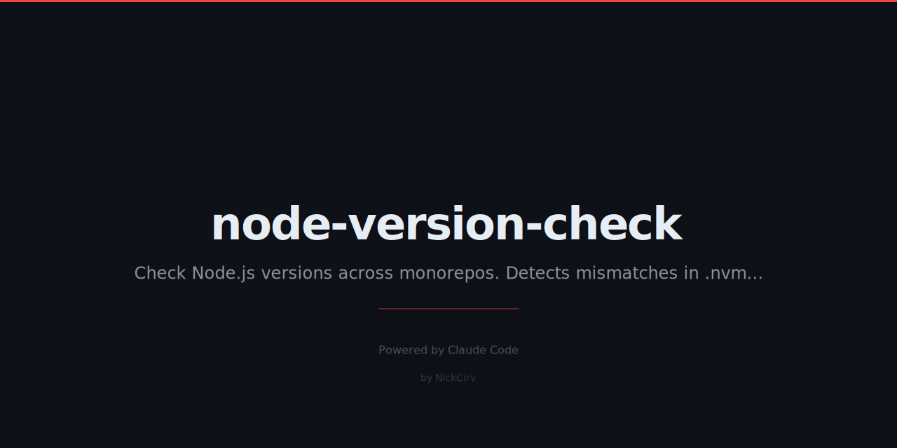

# node-version-check

Zero-dependency CLI to check Node.js version requirements across a monorepo. Finds mismatches between `.nvmrc`, `.node-version`, `package.json engines`, `.tool-versions`, and your currently running Node.

**No `npm install` needed for runtime — pure Node.js built-ins only.**

## Install

```bash
npm install -g node-version-check
```

Or run directly:

```bash
npx node-version-check
```

## Usage

```
nvc [command] [options]
node-version-check [command] [options]
```

## Commands

### Default — check current project

```bash
nvc
```

Reads `.nvmrc`, `.node-version`, `.tool-versions`, and `package.json engines.node` from the current directory. Compares each against the running Node version and shows compatibility.

```
Node Version Check
Current Node: v20.11.0
Directory: /your/project

  ✅  .nvmrc                         20
  ✅  .node-version                  20.11.0
  ⚠️   .tool-versions (nodejs)        (not found)
  ✅  package.json engines.node      >=18

  All version requirements satisfied.
```

### `--scan [dir]` — monorepo scan

```bash
nvc --scan .
nvc --scan ./packages
```

Walks all subdirectories for `package.json` files. Reports `engines.node` per package and highlights inconsistencies.

```
Monorepo Scan
Current Node: v20.11.0
Scanning: /your/monorepo

  Found 4 package(s)

  Package                   engines.node      Compatible?
  ─────────────────────────────────────────────────────
  ✅  root                    >=18              .
  ✅  @app/api                >=18              packages/api
  ❌  @app/legacy             >=16 <18          packages/legacy
  ⚠️   @app/utils             (not set)         packages/utils
```

### `--fix` — sync version files

```bash
nvc --fix
```

Updates `.nvmrc` and `.node-version` to match the major version from `package.json engines.node`. Shows a diff and prompts for confirmation before writing.

```
Fix Version Files
Directory: /your/project

  engines.node: >=20
  Target version: 20

  →  .nvmrc: Create → 20
  →  .node-version: Update → 20 (was: 18)

  Apply these changes? (y/N)
```

### `--latest` — check for Node.js updates

```bash
nvc --latest
```

Fetches the live release list from `nodejs.org` and compares your running version against the latest LTS and latest Current releases.

```
Node.js Release Information
Fetching from nodejs.org...

  Running:          v20.11.0
  Latest Current:   v23.6.0
  Latest LTS:       v22.13.0
  v20 Latest:       v20.18.0

  Recent LTS Releases:
  → v20.18.0    LTS: Iron          Released: Oct 2024 ← you are here
    v18.20.4    LTS: Hydrogen      Released: Apr 2024
    v16.20.2    LTS: Gallium       Released: Aug 2023
```

### `--matrix [dir]` — compatibility matrix

```bash
nvc --matrix
nvc --matrix ./packages
```

Shows a compatibility matrix: packages as rows, Node LTS versions as columns.

```
Compatibility Matrix
Scanning: /your/monorepo

  Package             v18       v20       v22       v23
  ─────────────────────────────────────────────────────
  @app/api            ✅        ✅        ✅        ✅
  @app/legacy         ✅        ❌        ❌        ❌
  @app/utils          ⚠️         ⚠️         ⚠️         ⚠️
```

### `ci` — CI-focused output

```bash
nvc ci
nvc ci --format github
```

Exits with code `1` if the running Node does not satisfy any requirement found. Use `--format github` for GitHub Actions annotations.

```yaml
# .github/workflows/check.yml
- name: Check Node version
  run: npx node-version-check ci --format github
```

GitHub Actions output format:
```
::error::node-version-check: Node v18.0.0 does not satisfy package.json engines.node: requires >=20
```

## Semver Ranges Supported

Hand-rolled parser — no `semver` package required.

| Range | Example | Meaning |
|-------|---------|---------|
| Exact major | `18` | Must be v18.x.x |
| Exact minor | `18.12` | Must be v18.12.x |
| Exact patch | `18.12.1` | Must be exactly v18.12.1 |
| `>=` | `>=18` | 18 or higher |
| `>` | `>16` | Greater than 16 |
| `<=` | `<=20` | 20 or lower |
| `<` | `<19` | Less than 19 |
| `^` | `^18` | Same major (>=18, <19) |
| `~` | `~18.0` | Same major.minor |
| Wildcard | `18.x` | Same major |
| Compound | `>=16 <20` | Both conditions |
| OR | `>=16 \|\| >=18` | Either condition |
| LTS alias | `lts/*` | Flagged as unknown |

## Options

| Flag | Description |
|------|-------------|
| `--dir <path>` | Target directory (default: cwd) |
| `--format github` | GitHub Actions annotation format (ci command only) |
| `--help`, `-h` | Show help |

## Environment

| Variable | Effect |
|----------|--------|
| `NO_COLOR=1` | Disable colored output |

## Requirements

- Node.js >= 18
- Zero runtime dependencies

## License

MIT
